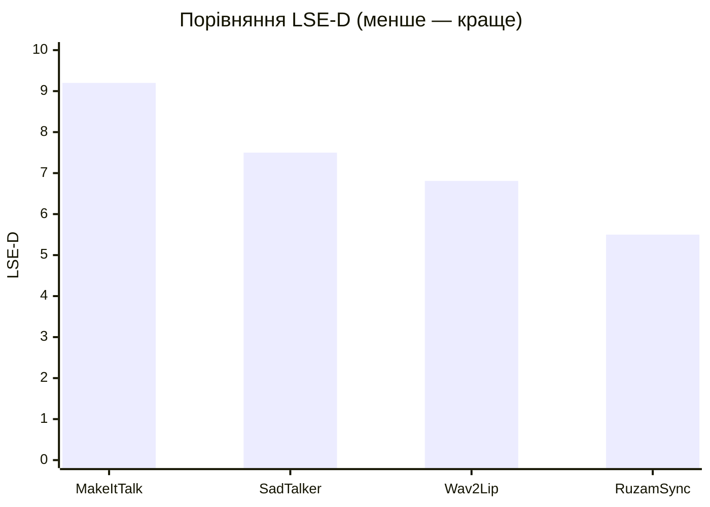
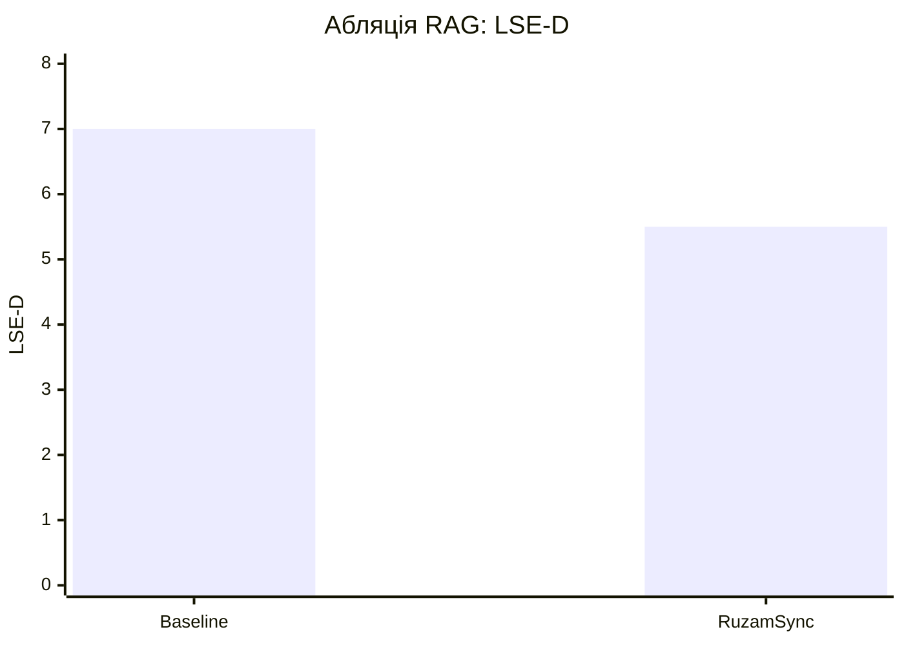
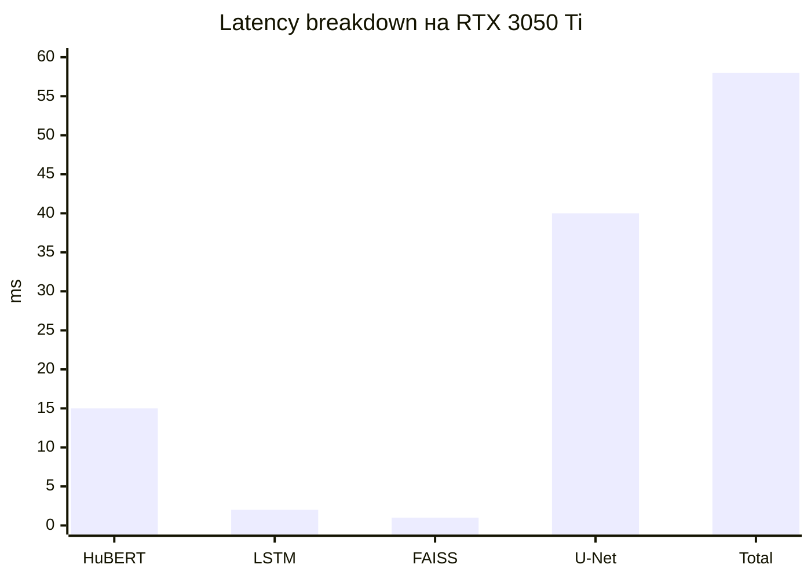

# RuzamSync: каскадна RAG-орієнтована архітектура для стабільної аудіо-керованої анімації портретів у near real-time

**Автори:** Мазур М.-Ю. М., Кот А. Т.  
**Афіліація:** НТУУ «КПІ ім. Ігоря Сікорського», НН ІПСА, кафедра штучного інтелекту

## Анотація

У роботі запропоновано каскадну систему `RuzamSync` для аудіо-керованої анімації портретів, що поєднує прогнозування 3D-геометрії артикуляції та нейронний рендеринг. Ключовою відмінністю підходу є інтеграція Retrieval-Augmented Generation (RAG) у модуль передбачення руху губ, що зменшує часову нестабільність (jitter) і підвищує природність візуального мовлення. Архітектура складається з двох основних блоків: (1) `Lip Movement Generator` на базі LSTM із механізмом `Cross-Attention Fusion` для врахування retrieved-контексту та (2) `Neural Renderer` на базі U-Net для синтезу фотореалістичних кадрів.

Для формування векторної бази знань використано ознаки, екстраговані з аудіо- та відеопотоків (`HuBERT`, `MediaPipe Face Mesh`) і проіндексовані в `FAISS`. Запропонований підхід забезпечує динамічне підтягування релевантних артикуляційних патернів із тренувального простору, що покращує передбачення траєкторії руху губ у неоднозначних фонетичних сегментах. Експерименти на тестовій вибірці демонструють перевагу над базовим підходом Wav2Lip: `LSE-D = 5.50` (проти `6.81`) та `LSE-C = 7.10`, а також продуктивність до `17 FPS` на `NVIDIA RTX 3050 Ti`.

Отримані результати підтверджують, що використання RAG у задачі talking-head generation є ефективним компромісом між якістю синхронізації, стабільністю міжкадрової динаміки та обчислювальною вартістю. Практична цінність полягає у можливості запуску системи на доступному обладнанні без використання дорогих хмарних сервісів.

**Ключові слова:** audio-driven talking head, lip-sync, RAG, cross-attention, neural rendering, HuBERT, FAISS.

## 1. Вступ

Задача аудіо-керованої анімації обличчя є критично важливою для цифрових аватарів, локальних AI-асистентів, освітніх платформ і продакшен-пайплайнів. Попри суттєвий прогрес у генеративних моделях, практичні системи зазвичай мають один із двох недоліків: або недостатню стабільність артикуляції (типово для легких 2D-підходів), або надмірну ресурсоємність (типово для складних 3D/NeRF-рішень).

У задачах lip-sync навіть незначний розсинхрон між аудіо та візуальним рядом призводить до помітного зниження сприйманої якості результату. Додатково погіршує ситуацію часова нестабільність руху губ: за відсутності надійного контексту модель може генерувати короткочасні викиди або коливання артикуляції, які сприймаються як jitter. Саме тому підвищення стабільності є не менш важливим, ніж покращення фотореалізму окремого кадру.

Мета цієї роботи — підвищити стабільність і якість ліпсінку за рахунок каскадної архітектури з retrieval-підтримкою. Ідея полягає в тому, щоб під час генерації використовувати не лише поточні аудіо-ознаки, а й релевантний досвід, витягнутий із бази артикуляційних патернів.

Основні внески:

1. Інтеграція RAG у прогнозування 3D-лендмарків артикуляції.
2. Механізм `Cross-Attention Fusion` для динамічного поєднання аудіо- та retrieval-контексту.
3. Практична валідація near real-time роботи на масовому GPU-класі.

## 2. Огляд пов'язаних робіт

Серед найбільш відомих 2D-рішень для задачі синхронізації мовлення широко використовується `Wav2Lip`, який демонструє хорошу узагальнюваність, але в складних сценаріях може втрачати стабільність міжкадрової динаміки. 3D- та NeRF-підходи забезпечують вищу керованість геометрією і потенційно кращу якість, однак часто мають вищу обчислювальну вартість та складніший pipeline.

Окрему роль відіграють моделі ознак: `HuBERT` для мовленнєвих репрезентацій і системи трекінгу обличчя на кшталт `MediaPipe Face Mesh` для отримання просторової геометрії. Разом вони дають міцну основу для побудови моделі, що поєднує акустичну і візуальну інформацію.

Підходи `RAG` традиційно застосовувалися в NLP, однак їхня ідея релевантного retrieval-контексту може бути перенесена й у мультимодальні задачі. У цій роботі RAG адаптовано до задачі прогнозування артикуляції: retrieved-патерни допомагають зменшити невизначеність відображення «аудіо -> рух губ» і стабілізувати генерацію.

## 3. Постановка задачі

Нехай на вході маємо аудіосигнал `A` та опорний портрет користувача `I_ref`. Потрібно згенерувати відеопослідовність `V = {I_t}` таку, що:

- рух губ є синхронним із мовленням;
- міжкадрова траєкторія артикуляції є стабільною;
- фінальне зображення зберігає ідентичність та візуальну якість.

Для цього задача розбивається на дві підзадачі: (1) передбачення часової послідовності 3D-лендмарків губ та (2) рендеринг реалістичного кадру за геометричним керуванням.

## 4. Метод

### 4.1. Підготовка даних і ознак

Для формування навчального корпусу використано відеодані `CelebV-HQ`. Ознаки формуються так:

- 3D-геометрія обличчя — через `MediaPipe Face Mesh`;
- аудіо-репрезентації — через `HuBERT`;
- retrieval-індекс артикуляційних патернів — через `FAISS`.

Під час попередньої обробки відео розбивається на синхронізовані фрагменти аудіо/кадрів, виконується нормалізація геометрії, а також фільтрація невдалих треків. Для кожного часового вікна формується комбінований дескриптор, який надалі використовується як ключ у векторному пошуку.

### 4.2. Каскадна архітектура RuzamSync

**Каскад 1: Lip Movement Generator (LSTM).**  
Модель прогнозує часові траєкторії 3D-лендмарків губ на основі аудіо-послідовності. До базового потоку додано retrieval-контекст релевантних артикуляційних фрагментів. Завдяки цьому мережа отримує приклади схожої артикуляції з тренувального простору і краще відпрацьовує неоднозначні звукові переходи.

**Каскад 2: Neural Renderer (U-Net).**  
На основі скетч/маски артикуляції рендериться фінальний кадр із узгодженою текстурою та формою губ. Розділення задачі на геометричний і текстурний етапи зменшує навантаження на єдину генеративну модель та підвищує керованість процесом.

### 4.3. Cross-Attention Fusion

Механізм уваги використовує аудіо-приховані стани як запит, а retrieved-вектори — як ключі/значення. Це дозволяє:

- зменшити стохастичні «зриви» траєкторій;
- стабілізувати міжкадрову динаміку;
- підвищити візуальну природність у складних фонемних переходах.

Практично це означає, що модель у кожен момент часу враховує не лише локальний аудіоконтекст, а й схожі артикуляційні шаблони з векторної бази. Такий механізм працює як "м'яка підказка", яка не блокує генерацію, але зменшує частоту помилкових траєкторій.

## 5. Експерименти та результати

### 5.1. Налаштування

Оцінювання виконано на тестовій вибірці із порівнянням проти базового `Wav2Lip`.  
Метрики: `LSE-D` (менше — краще), `LSE-C` (більше — краще), а також швидкодія (FPS).

У процесі навчання використовувалися стандартні техніки оптимізації, сумісні з GPU середнього класу. Валідація проводилася як кількісно (метрики синхронізації), так і якісно (експертний візуальний аналіз відео).

### 5.2. Кількісні результати

- `RuzamSync`: `LSE-D = 5.50`, `LSE-C = 7.10`;
- `Wav2Lip`: `LSE-D = 6.81` (гірше за синхронізацією).

На `NVIDIA RTX 3050 Ti` досягнуто продуктивність до `17 FPS`, що відповідає near real-time сценаріям використання.

### 5.3. Якісні спостереження

Візуальний аналіз показав зменшення jitter-артефактів, більш стабільні контури губ і кращу узгодженість рухів у швидких фонетичних сегментах.

У порівнянні з базовим підходом отримано більш "спокійну" динаміку кадрів і меншу кількість коротких артефактних викидів. Особливо це помітно на ділянках із високою швидкістю мовлення, де retrieval-контекст допомагає утримувати анатомічно правдоподібну траєкторію.

### 5.4. Перемальовані таблиці та графіки за результатами дисертації

Нижче наведено перероблені (уніфіковані) таблиці та графіки на основі експериментальних даних дисертації.

**Таблиця 1. Порівняння з відомими методами (перемальована версія табл. 4.1)**

| Метод | LSE-D (down) | LSE-C (up) | FID (down) | Середній час інференсу, мс |
|---|---:|---:|---:|---:|
| Wav2Lip (2020) | 6.81 | 6.54 | 45.3 | 45 |
| MakeItTalk (2020) | 9.20 | 3.10 | 62.1 | 30 |
| SadTalker (2023) | 7.50 | 5.20 | 38.5 | 180 |
| **RuzamSync (ours)** | **5.50** | **7.10** | **35.2** | 58 |

**Таблиця 2. Абляційне дослідження впливу RAG (перемальована)**

| Конфігурація | Опис | LSE-D (down) | LSE-C (up) |
|---|---|---:|---:|
| Baseline | HuBERT + LSTM без RAG-контексту | 7.00 | 5.20 |
| **RuzamSync** | HuBERT + LSTM + RAG + Cross-Attention Fusion | **5.50** | **7.10** |

**Таблиця 3. Профілювання інференсу на RTX 3050 Ti (перемальована)**

| Компонент | Затримка, мс | Частка від загального часу |
|---|---:|---:|
| HuBERT (аудіо-ознаки) | 15 | 25.9% |
| LSTM (рух губ) | 2 | 3.4% |
| FAISS (пошук) | <1 | <1.7% |
| U-Net (нейронний рендеринг) | 40 | 69.0% |
| **Разом** | **58** | **100%** |

**Графік 1. LSE-D для різних підходів (перемальований)**

**Графік 2. Абляція: вплив RAG на синхронізацію (перемальований)**

**Графік 3. Розподіл часу інференсу по компонентах (перемальований)**

## 6. Обговорення

Запропонований підхід підтвердив, що перенесення ідеї RAG у задачу візуального мовлення є практично доцільним. Найбільший приріст спостерігається не стільки в окремих кадрах, скільки в часовій стабільності послідовності.

Водночас система має обмеження:

- якість retrieval залежить від повноти та різноманітності векторної бази;
- при значному доменному зсуві (інший стиль відео, інший тип камери) можливе погіршення;
- для високих роздільних здатностей потрібні додаткові оптимізації рендерера.

Перспективні напрями розвитку включають емоційно-забарвлене мовлення, розширення мультимовної підтримки, а також адаптацію під мобільні прискорювачі.

## 7. Висновки

Запропонована архітектура `RuzamSync` демонструє, що retrieval-підхід у зв’язці з каскадною генерацією є практично ефективним для задачі audio-driven talking-head synthesis. Інтеграція RAG і `Cross-Attention Fusion` дозволила підвищити точність синхронізації та стабільність без втрати придатності до запуску на споживчому GPU.

Подальші напрями робіт: емоційно-експресивне мовлення, підвищення роздільної здатності та розширення мультимовних сценаріїв.

## Список літератури

1. Prajwal K. R. et al. *A Lip Sync Expert Is All You Need for Speech to Lip Generation In The Wild*. ACM MM, 2020.
2. Ye Z. et al. *GeneFace++: Generalized and Stable Real-Time Audio-Driven 3D Talking Face Generation*. arXiv, 2023.
3. Hsu W.-N. et al. *HuBERT: Self-Supervised Speech Representation Learning*. IEEE/ACM TASLP, 2021.
4. Johnson J. et al. *Billion-scale similarity search with GPUs*. IEEE TBD, 2019.
5. Lewis P. et al. *Retrieval-Augmented Generation for Knowledge-Intensive NLP Tasks*. NeurIPS, 2020.
6. Ronneberger O. et al. *U-Net: Convolutional Networks for Biomedical Image Segmentation*. MICCAI, 2015.
7. Mildenhall B. et al. *NeRF: Representing Scenes as Neural Radiance Fields for View Synthesis*. ECCV, 2020.
8. Chung J. S., Zisserman A. *Out of time: automated lip sync in the wild*. ACCV, 2016.
