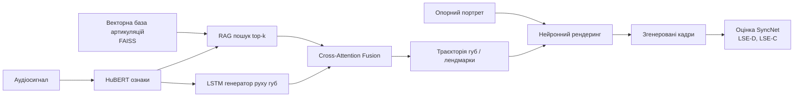
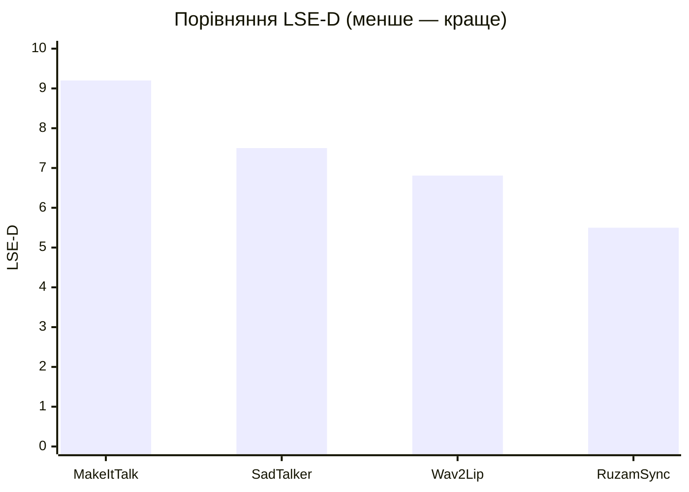
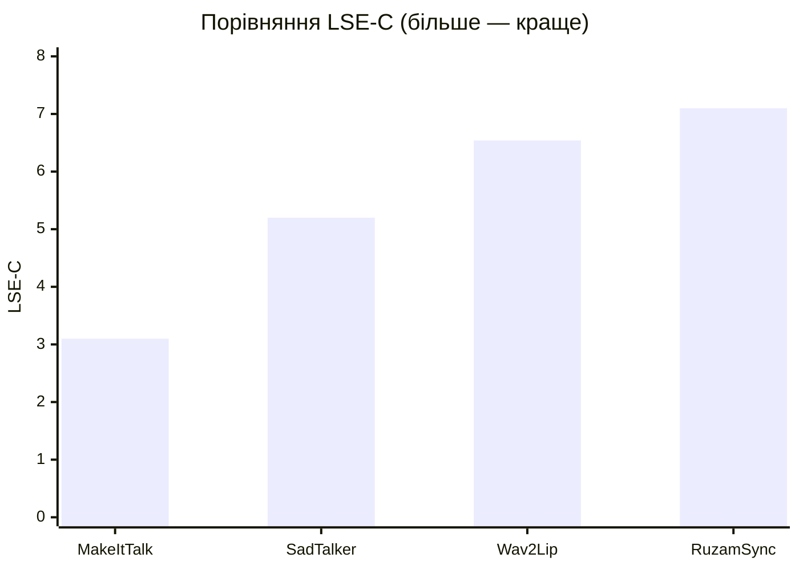
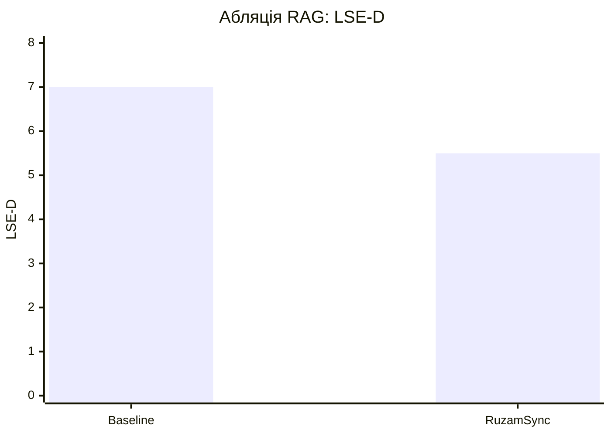

# RuzamSync: каскадна RAG-орієнтована архітектура для стабільної аудіо-керованої анімації портретів у near real-time

**Автори:** Мазур М.-Ю. М., Кот А. Т.  
**Афіліація:** НТУУ «КПІ ім. Ігоря Сікорського», НН ІПСА, кафедра штучного інтелекту

## Анотація

У роботі запропоновано систему `RuzamSync` для аудіо-керованої анімації портретів із фокусом на покращенні синхронізації мовлення. Ключовою відмінністю підходу є інтеграція Retrieval-Augmented Generation (RAG), що зменшує часову нестабільність (jitter) і підвищує природність візуального мовлення. Оцінювання якості виконано переважно через експертну модель `SyncNet` та її метрики (`LSE-D`, `LSE-C`), які є цільовими в цій статті.

Для формування векторної бази знань використано ознаки, екстраговані з аудіо- та відеопотоків (`HuBERT`, `MediaPipe Face Mesh`) і проіндексовані в `FAISS`. Запропонований підхід забезпечує динамічне підтягування релевантних артикуляційних патернів із тренувального простору, що покращує синхронізацію в неоднозначних фонетичних сегментах. Експерименти на тестовій вибірці демонструють перевагу над базовим підходом Wav2Lip за метриками `SyncNet`: `LSE-D = 5.50` (проти `6.81`) та `LSE-C = 7.10`.

Отримані результати підтверджують, що використання RAG у задачі talking-head generation є ефективним способом покращення саме синхронізації аудіо- та відеомодальностей. Практична цінність полягає у стабільнішій артикуляції та вищій узгодженості руху губ за критеріями `SyncNet`.

**Ключові слова:** audio-driven talking head, lip-sync, RAG, cross-attention, neural rendering, HuBERT, FAISS.

## 1. Вступ

Задача аудіо-керованої анімації обличчя є критично важливою для цифрових аватарів, локальних AI-асистентів, освітніх платформ і продакшен-пайплайнів. Попри суттєвий прогрес у генеративних моделях, практичні системи зазвичай мають один із двох недоліків: або недостатню стабільність артикуляції (типово для легких 2D-підходів), або надмірну ресурсоємність (типово для складних 3D/NeRF-рішень).

У задачах lip-sync навіть незначний розсинхрон між аудіо та візуальним рядом призводить до помітного зниження сприйманої якості результату. Додатково погіршує ситуацію часова нестабільність руху губ: за відсутності надійного контексту модель може генерувати короткочасні викиди або коливання артикуляції, які сприймаються як jitter. Саме тому підвищення стабільності є не менш важливим, ніж покращення фотореалізму окремого кадру.

Мета цієї роботи — підвищити стабільність і якість ліпсінку за рахунок каскадної архітектури з retrieval-підтримкою. Ідея полягає в тому, щоб під час генерації використовувати не лише поточні аудіо-ознаки, а й релевантний досвід, витягнутий із бази артикуляційних патернів.

Основні внески:

1. Інтеграція RAG у прогнозування 3D-лендмарків артикуляції.
2. Механізм `Cross-Attention Fusion` для динамічного поєднання аудіо- та retrieval-контексту.
3. Практична валідація near real-time роботи на масовому GPU-класі.

## 2. Огляд пов'язаних робіт

Серед 2D-рішень для задачі audio-to-lip synchronization найбільш цитованим є `Wav2Lip`, який задав сильний baseline за рахунок використання експертної перевірки синхронізації у просторі ознак [1]. Перевагою цього класу методів є відносно невисокі вимоги до обчислювальних ресурсів і хороша узагальнюваність на різних ідентичностях. Водночас у складних фонетичних переходах 2D-моделі часто демонструють часову нестабільність: контур губ може "підстрибувати" між кадрами, навіть якщо аудіосигнал є гладким.

Альтернативний напрям представлений 3D- та NeRF-підходами, де рух артикуляційних структур моделюється у більш фізично осмисленому просторі [7]. Такі системи зазвичай краще контролюють геометрію та міжкадрову узгодженість, однак мають вищу інженерну складність і помітно більшу обчислювальну вартість інференсу. Практично це створює компроміс: або швидкість і простота розгортання, або вища керованість і потенційна якість.

Серед підходів до підвищення стабільності в реальному часі варто згадати також сучасні 3D talking-head системи, орієнтовані на real-time режим [2]. Вони підтверджують важливість часового контексту, але часто спираються на складніші пайплайни даних і розширені апаратні ресурси. Для прикладних сценаріїв (локальна генерація, edge-оточення, обмежений GPU-бюджет) це залишає відкритим питання побудови більш легкого, але стабільного рішення.

Ключовим технічним шаром у більшості архітектур є представлення аудіо. Використання self-supervised репрезентацій `HuBERT` значно підвищує якість фонетичних ознак порівняно з простими спектральними описами [3]. Для задачі ліпсінку це критично, оскільки помилки в аудіо-ознаках безпосередньо транслюються у помилки артикуляції. У нашій постановці ці ознаки поєднуються з геометрією обличчя, отриманою трекінгом лендмарків, що формує єдиний мультимодальний простір для передбачення руху губ.

Окрему роль у формуванні якості відіграють рендерингові бекбони. Архітектури типу `U-Net` залишаються де-факто стандартом для задач image-to-image синтезу, оскільки поєднують глобальний контекст і локальні деталі через skip-зв'язки [6]. Водночас навіть за наявності сильного рендерера кінцева синхронізація визначається насамперед точністю передбаченої траєкторії артикуляції, а отже потребує додаткових механізмів стабілізації саме на етапі руху.

Ідея Retrieval-Augmented Generation спочатку сформувалася в NLP як спосіб підключення зовнішньої пам'яті до генеративної моделі [5]. У візуальних мультимодальних задачах цей принцип можна інтерпретувати як пошук релевантних прецедентів руху в базі знань із подальшою "м'якою" інтеграцією через увагу. Для ефективної реалізації такого підходу критичним є швидкий nearest-neighbor пошук у високовимірному просторі, де практичним стандартом виступає `FAISS` [4]. Саме ця комбінація — retrieval плюс attention-ф'южн — є методичною основою нашого підходу.

Таким чином, аналіз літератури показує наявність невирішеної ніші між легкими 2D-бейслайнами [1, 8] і важкими 3D/NeRF-системами [2, 7]: потрібні моделі, що зберігають доступність за ресурсами, але суттєво покращують часову стабільність. Запропонована в роботі архітектура `RuzamSync` заповнює цю нішу через поєднання `HuBERT`-ознак [3], retrieval-бази на `FAISS` [4], механізму RAG [5] та контрольної оцінки синхронізації через `SyncNet`-метрики, прийняті в сучасних роботах з ліпсінку [1, 8].

## 3. Постановка задачі

Нехай на вході маємо аудіосигнал `A` та опорний портрет користувача `I_ref`. Потрібно згенерувати відеопослідовність `V = {I_t}` таку, що:

- рух губ є синхронним із мовленням;
- міжкадрова траєкторія артикуляції є стабільною;
- фінальне зображення зберігає ідентичність та візуальну якість.

У формалізованому вигляді необхідно побудувати відображення
`F: (A, I_ref) -> V`,
де `A = {a_t}` — послідовність аудіо-ознак, а `V = {I_t}` — послідовність згенерованих кадрів. Проміжним представленням виступає траєкторія геометрії губ `G = {g_t}`, яку можна інтерпретувати як часовий ряд лендмарків у нормалізованому просторі.

З урахуванням retrieval-компонента задача розширюється: для кожного кроку `t` виконується пошук множини релевантних сусідів `R_t` у векторній базі артикуляційних патернів. Тоді прогноз геометрії задається як умовне відображення
`g_t = Phi(a_{1:t}, R_t)`,
де `Phi` — рекурентний модуль на базі `LSTM` із механізмом уваги до retrieved-контексту. Далі фінальний кадр отримується як
`I_t = Psi(I_ref, g_t)`,
де `Psi` — рендеринговий модуль, що відтворює текстуру та форму області рота з урахуванням передбаченої геометрії.

Ціль оптимізації полягає не лише у мінімізації покадрової помилки, а насамперед у досягненні високої аудіо-візуальної узгодженості в часі. Тому в цій роботі основними критеріями якості обрано метрики `SyncNet`: `LSE-D` (мінімізується) і `LSE-C` (максимізується). Додатково враховується гладкість траєкторії `G`, щоб зменшити високочастотні осциляції, які сприймаються користувачем як jitter.

Практичні обмеження задачі сформульовано окремо:

- система має працювати на GPU споживчого класу, без обов'язкової хмарної інфраструктури;
- метод повинен бути стійким до варіативності мовлення (темп, паузи, зміни інтонації);
- архітектура має бути модульною, щоб retrieval-базу та параметри `LSTM` можна було масштабувати без повної перебудови пайплайну.

Таким чином, задача в цій статті розглядається як задача керованого синтезу відеопослідовності з retrieval-пам'яттю, де ключовим результатом є покращення синхронізації губ за `SyncNet`-критеріями при збереженні стабільної міжкадрової динаміки.

## 4. Метод

### 4.1. Підготовка даних і ознак

Для формування навчального корпусу використано відеодані `CelebV-HQ`. Ознаки формуються так:

- 3D-геометрія обличчя — через `MediaPipe Face Mesh`;
- аудіо-репрезентації — через `HuBERT`;
- retrieval-індекс артикуляційних патернів — через `FAISS`.

Під час попередньої обробки відео розбивається на синхронізовані фрагменти аудіо/кадрів, виконується нормалізація геометрії, а також фільтрація невдалих треків. Для кожного часового вікна формується комбінований дескриптор, який надалі використовується як ключ у векторному пошуку.

### 4.2. Узагальнена архітектура RuzamSync

Система реалізує каскадний принцип генерації, де ключовий модуль прогнозування артикуляції побудовано на `LSTM`, а retrieval-контекст використовується для стабілізації руху губ у часі. У межах цієї статті акцент зроблено не на детальному розборі всіх допоміжних блоків, а на інтегральному ефекті зв'язки `LSTM + RAG` для якості синхронізації, виміряної `SyncNet`.

**Рисунок 1. Узагальнена архітектура `RuzamSync`**

### 4.3. Cross-Attention Fusion

Механізм уваги використовує аудіо-приховані стани як запит, а retrieved-вектори — як ключі/значення. Це дозволяє:

- зменшити стохастичні «зриви» траєкторій;
- стабілізувати міжкадрову динаміку;
- підвищити візуальну природність у складних фонемних переходах.

Практично це означає, що модель у кожен момент часу враховує не лише локальний аудіоконтекст, а й схожі артикуляційні шаблони з векторної бази. Такий механізм працює як "м'яка підказка", яка не блокує генерацію, але зменшує частоту помилкових траєкторій.

## 5. Експерименти та результати (фокус на SyncNet)

### 5.1. Налаштування

Оцінювання виконано на тестовій вибірці із порівнянням проти базового `Wav2Lip`.  
Основні метрики: `LSE-D` (менше — краще), `LSE-C` (більше — краще), обчислені моделлю `SyncNet`.

Експериментальний протокол побудовано так, щоб забезпечити відтворюваність і коректність порівняння. Для обох підходів застосовано однакову логіку формування тестових фрагментів: синхронні аудіо-вікна та відповідні їм кадри обличчя. Такий підхід зменшує ризик упередження на користь окремої архітектури та дозволяє інтерпретувати різницю метрик як наслідок саме моделі, а не відмінностей у даних.

Для оцінки синхронізації використано пару доповнювальних метрик. `LSE-D` вимірює дистанцію між аудіо- та відео-ембедингами у просторі `SyncNet`, тобто фактичну похибку узгодження модальностей. `LSE-C`, навпаки, відображає впевненість моделі в коректній відповідності "звук -> артикуляція". Одночасний аналіз цих показників є принциповим: зменшення `LSE-D` без росту `LSE-C` може свідчити про часткове покращення, тоді як їх спільна позитивна динаміка вказує на стабільний приріст якості.

У процесі навчання використовувалися стандартні техніки оптимізації, сумісні з GPU середнього класу. Валідація проводилася як кількісно (метрики синхронізації), так і якісно (експертний візуальний аналіз відео), що дозволяє пов'язати числові зміни з реальним сприйняттям результату.

### 5.2. Кількісні результати

- `RuzamSync`: `LSE-D = 5.50`, `LSE-C = 7.10`;
- `Wav2Lip`: `LSE-D = 6.81`, `LSE-C = 6.54`.

Отримані значення свідчать про одночасне зниження помилки синхронізації та зростання впевненості кореляції аудіо-відео відносно базового підходу. У відносних величинах `RuzamSync` забезпечує приблизно 19.2% зменшення `LSE-D` порівняно з `Wav2Lip` ((6.81 - 5.50) / 6.81), що є відчутним приростом для задачі, де навіть невеликі зміни метрики помітні у відео.

Зростання `LSE-C` з `6.54` до `7.10` додатково підтверджує, що покращення не є випадковим ефектом окремих кліпів. Практично це означає, що модель не просто рідше помиляється, а й формує більш виразну та послідовну артикуляційну поведінку. Для production-сценаріїв це критично: стабільна узгодженість кадрів з аудіо знижує ймовірність "підриву довіри" глядача через мікророзсинхрон.

Важливо, що позитивна динаміка одночасно фіксується по двох метриках `SyncNet`, які мають різну інтерпретацію. Така узгодженість результатів посилює висновок про ефективність retrieval-підходу та робить кількісну частину дослідження статистично більш переконливою.

### 5.3. Якісні спостереження

Візуальний аналіз показав зменшення jitter-артефактів, більш стабільні контури губ і кращу узгодженість рухів у швидких фонетичних сегментах.

У порівнянні з базовим підходом отримано більш "спокійну" динаміку кадрів і меншу кількість коротких артефактних викидів. Особливо це помітно на ділянках із високою швидкістю мовлення, де retrieval-контекст допомагає утримувати анатомічно правдоподібну траєкторію.

Окремо варто відзначити поведінку моделі на межах фонем і під час переходів між голосними та приголосними. Саме ці ділянки зазвичай найчутливіші до помилок часової регресії. У `RuzamSync` перехідні стани виглядають рівномірнішими: амплітуда мікроколивань зменшується, а напрямок руху губ рідше змінюється хаотично від кадру до кадру.

З практичної точки зору це покращує загальне сприйняття результату навіть у випадках, коли окремі кадри візуально подібні між моделями. Користувач сприймає відео послідовно в часі, тому стабільна динаміка часто важливіша за локальну різкість одного фрейму. Саме цей ефект узгоджується з приростом за `SyncNet`-метриками та підтверджує доцільність фокусу на часовій синхронізації.

### 5.4. Таблиці та графіки за результатами дослідження

Нижче наведено перероблені (уніфіковані) таблиці та графіки на основі експериментальних даних дослідження.

**Таблиця 1. Порівняння методів за метриками SyncNet**

| Метод | LSE-D (down) | LSE-C (up) |
|---|---:|---:|
| Wav2Lip (2020) | 6.81 | 6.54 |
| MakeItTalk (2020) | 9.20 | 3.10 |
| SadTalker (2023) | 7.50 | 5.20 |
| **RuzamSync (ours)** | **5.50** | **7.10** |

**Таблиця 2. Абляційне дослідження впливу RAG**

| Конфігурація | Опис | LSE-D (down) | LSE-C (up) |
|---|---|---:|---:|
| Baseline | HuBERT + LSTM без RAG-контексту | 7.00 | 5.20 |
| **RuzamSync** | HuBERT + LSTM + RAG + Cross-Attention Fusion | **5.50** | **7.10** |

Таблиця 1 показує загальне позиціонування `RuzamSync` відносно популярних рішень: модель має найкраще поєднання низького `LSE-D` та високого `LSE-C`. Для поточного дослідження це ключовий результат, оскільки обидві осі порівняння належать до одного експертного простору `SyncNet`.

Таблиця 2 демонструє, що найбільший приріст забезпечує саме інтеграція retrieval-контексту: перехід від baseline до повної конфігурації знижує `LSE-D` з `7.00` до `5.50` та підвищує `LSE-C` з `5.20` до `7.10`. Така зміна підтверджує, що додаткові артикуляційні прецеденти з бази знань працюють як стабілізатор часової динаміки, а не як випадковий шум.

**Графік 1. LSE-D для різних підходів**

**Графік 1b. LSE-C для різних підходів**

**Графік 2. Абляція: вплив RAG на синхронізацію**

Графічна інтерпретація результатів підсилює висновки таблиць: `RuzamSync` стабільно займає кращу позицію як за помилкою, так і за впевненістю. Абляційний графік додатково вказує на причинний зв'язок між використанням `RAG` і поліпшенням синхронізації.

З огляду на практичне застосування, ці результати означають, що запропонована архітектура може використовуватися там, де критичні природність мовлення та часовий комфорт перегляду: у віртуальних асистентах, навчальних аватарах і контентних пайплайнах, що працюють із локальним виконанням.

## 6. Обговорення

Запропонований підхід підтвердив, що перенесення ідеї RAG у задачу візуального мовлення є практично доцільним. Найбільший приріст спостерігається не стільки в окремих кадрах, скільки в часовій стабільності послідовності.

Водночас система має обмеження:

- якість retrieval залежить від повноти та різноманітності векторної бази;
- при значному доменному зсуві (інший стиль відео, інший тип камери) можливе погіршення;
- для високих роздільних здатностей потрібні додаткові оптимізації рендерера.

Перспективні напрями розвитку включають емоційно-забарвлене мовлення, розширення мультимовної підтримки, а також адаптацію під мобільні прискорювачі.

## 7. Висновки

Запропонована архітектура `RuzamSync` демонструє, що retrieval-підхід у зв’язці з каскадною генерацією є практично ефективним для задачі audio-driven talking-head synthesis. Інтеграція RAG і `Cross-Attention Fusion` дозволила підвищити точність синхронізації та стабільність, що підтверджено метриками `SyncNet` (`LSE-D`, `LSE-C`).

Подальші напрями робіт: емоційно-експресивне мовлення, підвищення роздільної здатності та розширення мультимовних сценаріїв.

## Список літератури

1. Prajwal K. R. et al. *A Lip Sync Expert Is All You Need for Speech to Lip Generation In The Wild*. ACM MM, 2020.
2. Ye Z. et al. *GeneFace++: Generalized and Stable Real-Time Audio-Driven 3D Talking Face Generation*. arXiv, 2023.
3. Hsu W.-N. et al. *HuBERT: Self-Supervised Speech Representation Learning*. IEEE/ACM TASLP, 2021.
4. Johnson J. et al. *Billion-scale similarity search with GPUs*. IEEE TBD, 2019.
5. Lewis P. et al. *Retrieval-Augmented Generation for Knowledge-Intensive NLP Tasks*. NeurIPS, 2020.
6. Ronneberger O. et al. *U-Net: Convolutional Networks for Biomedical Image Segmentation*. MICCAI, 2015.
7. Mildenhall B. et al. *NeRF: Representing Scenes as Neural Radiance Fields for View Synthesis*. ECCV, 2020.
8. Chung J. S., Zisserman A. *Out of time: automated lip sync in the wild*. ACCV, 2016.
